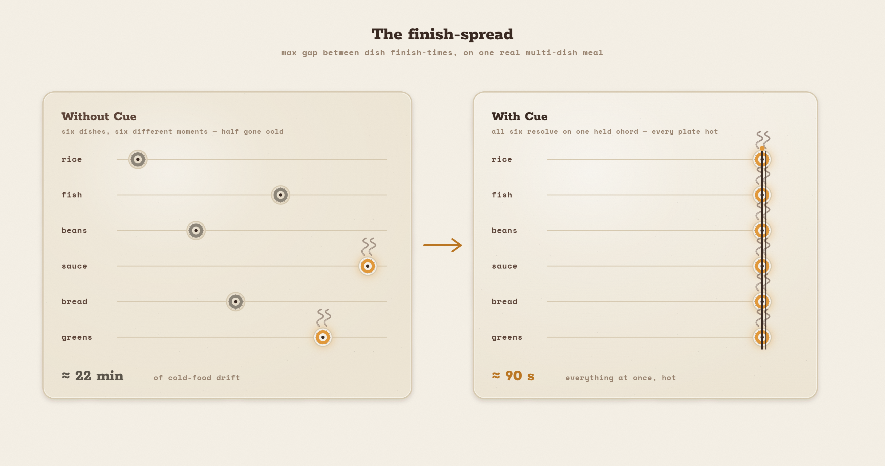

# Cue — *Dinner, on cue.*

> **A recipe tells you what to do. It never tells you *when*.**
>
> Prop a spare phone at the stove. Cue watches your pans with its own eyes, learns your
> whole meal, and **conducts the timing** — calling every move at the exact beat so a
> dozen dishes all land hot, together — and it **never sends a frame of your kitchen
> anywhere.**

Cue turns any spare phone or laptop into an **edge conductor** for your stove. It
**perceives on the device** (camera + microphone → on-device object / doneness / audio
reflex), **reasons in Qwen Cloud** (a resource-constrained schedule-graph + live
re-optimization), and **acts locally** (spoken cues, an on-screen orchestral score, and
instant local safety alerts). Track 5 — EdgeAgent, Qwen Cloud Global AI Hackathon.

The whole app is drawn as **"The Stove as an Orchestral Score"**: burners and hands are
staff lines, actions are notes, a *now* bar sweeps toward a single **held chord** — the
moment every dish is done at once. When reality diverges, the notes visibly slide to keep
the finale aligned. That slide is the re-optimizer, rendered as something you can watch.


---

## The one undeniable mechanic

**Point the phone at the stove → it reads the pans → it plans the whole meal → it
conducts the timing → everything lands hot together → it re-plans live the moment you
diverge.**

The money shot is un-fakeable: on your own meal, with your own disruption (swap white
rice → brown, fall behind, let a pan run hot), Cue re-optimizes the *entire* timeline live
so everything still lands together — computed on your disruption, not scripted.



---

## Architecture

Cue is **one loop** — `perceive → reason → act → degrade` — split across the edge (the
phone) and Qwen Cloud. It runs as a **static PWA client** plus a **thin server** whose
only job is to hold the `sk-` key and proxy Qwen. The client is fully functional on its
own; the server is an enhancement seam.

```
┌───────────────────────── the phone (edge) ─────────────────────────┐      ┌── Qwen Cloud ──┐
│                                                                     │      │  dashscope-intl │
│  getUserMedia ─▶ on-device reflex (non-Qwen, WebGPU/WASM)           │      │                 │
│    · object detector  (TF.js COCO-SSD)                              │      │ qwen3-vl-plus   │
│    · doneness CV       (motion / hue / steam)   ──┐ distilled       │ ───▶ │ qwen3.7-plus    │
